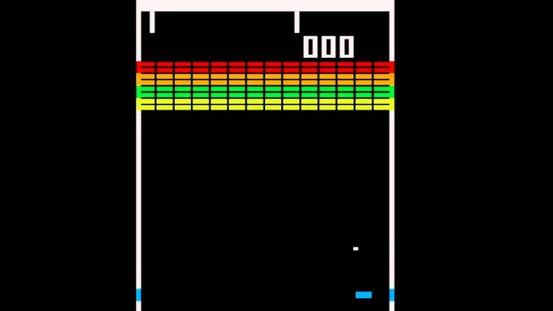
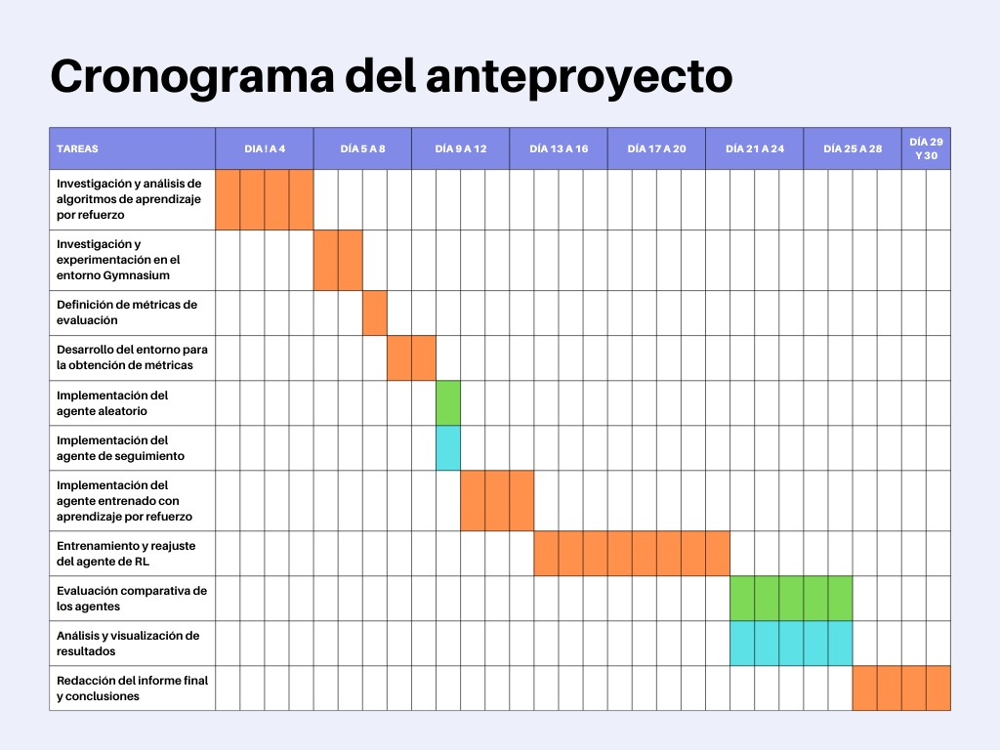

# Aprendizaje por refuerzo para Atari Breakout
### Codigo: ARABIM
### Integrantes: Coppede Santos Ignacio, Sorbello Mauro

## Introducción: 

Atari Breakout es un videojuego arcade desarrollado por Atari, Inc. y lanzado al mercado el 13 de mayo de 1976. En la parte inferior de la pantalla una barra horizontal simula una raqueta de tenis que el agente puede desplazar de izquierda a derecha.​ En la parte superior se situa una banda conformada por rectángulos que simulan ser ladrillos. Una bola desciende de la nada y el agente debe golpearla con la raqueta, entonces la pelota asciende hasta pegar en el muro, los ladrillos tocados por la pelota desaparecen. La pelota vuelve a descender y así sucesivamente. El objetivo del juego era terminar con la pared de ladrillos.
El objetivo de este proyecto es entrenar un agente, con la técnica de aprendizaje por refuerzo, para que cumpliendo una serie de métricas, evaluar si puede superar ciertos niveles y con que desempeño.

## Descripción del problema:

Para trabajar sobre los escenarios de Atari Breakout se utilizaran, en principio, los entornos provistos por la librería gymnasium de Python. 

### Métricas:

- Cantidad de veces que golpea la pelota antes de romper todos los ladrillos
- Cantidad de vidas con las que completa el nivel (Máximo 3 vidas)
- Cuanto tiempo tarda en pasar de nivel
- Cantidad de veces que supera los niveles luego de una cantidad fija de niveles.

### Agentes:

Se prevé que se apliquen algoritmos para comparar las métricas y por ende el rendimiento entre estos. Los algoritmos de comparación serán un algoritmo aleatorio y un algoritmo que siempre siga la pelota. Mientras que el algoritmo entrenado con aprendizaje por refuerzo pueden ser tanto q-learning como DQN, siendo más probable la implementación de únicamente el primero nombrado.

## Justificación: 

Por la naturaleza del videojuego en general el agente debe realizar una serie de decisiones a lo largo del tiempo, donde cada acción afecta el estado futuro y, eventualmente, el éxito en el juego. El aprendizaje por refuerzo es ideal para este tipo de problemas secuenciales. Además, en algoritmos de Q-learning, el agente aprende a estimar la "calidad" de cada acción en cada estado, lo que le permite tomar decisiones informadas que lo acerquen a su objetivo de maximizar la puntuación.
Por último, los algoritmos de aprendizaje por refuerzo son capaces de generalizar y adaptar sus decisiones basándose en la experiencia acumulada en partidas anteriores, lo que les permite mejorar con el tiempo, un enfoque que contrasta con los métodos tradicionales, que no evolucionan si el entorno cambia.

## Actividades:

Para alcanzar los objetivos propuestos, se llevará a cabo una serie de actividades planificadas y organizadas, incluyendo una estimación de la duración de cada una. Estas actividades se estructuran para cubrir desde la investigación inicial hasta la obtención y análisis de resultados.

1. Investigación y análisis de algoritmos de aprendizaje por refuerzo (4 días)
    - Estudiar los algoritmos Q-learning y DQN, comparando sus ventajas, desventajas y aplicaciones específicas en entornos de juegos.
    - Revisar bibliografía y recursos sobre aprendizaje por refuerzo aplicado a videojuegos, con foco en experimentos previos en Atari Breakout.

2. Investigación y experimentación en el entorno Gymnasium (2 días)
    - Explorar la configuración y características del entorno Gymnasium para Breakout, familiarizándose con las APIs disponibles para interactuar con el agente.
    - Realizar pruebas de funcionamiento básico para entender las observaciones, recompensas y estructura del entorno.

3. Definición de métricas de evaluación (1 día)
    - Identificar y formalizar las métricas para evaluar el rendimiento del agente, asegurando que estén alineadas con los objetivos del proyecto (golpes, vidas, tiempo, etc.).
    - Desarrollar criterios para analizar el rendimiento a nivel de nivel y de agente.

4. Implementación del agente aleatorio (1 día)
    - Crear un agente que ejecute movimientos aleatorios como línea base para comparar el desempeño.

5. Implementación del agente de seguimiento (1 día)

    - Desarrollar un agente sencillo que intente mantener la raqueta bajo la pelota, usando reglas fijas sin entrenamiento.
    - Probar y ajustar su comportamiento para obtener una referencia clara y consistente en el juego.

6. Implementación del agente entrenado con aprendizaje por refuerzo (3 días)
    - Configurar y codificar el agente que utilizará Q-learning o DQN.
    - Verificar su funcionamiento en el entorno Gymnasium.
7. Desarrollo del entorno para la obtención de métricas (2 días)
    - Configurar herramientas y funciones adicionales que registren datos de las métricas de rendimiento en cada episodio.
    - Asegurar que el entorno pueda registrar resultados y generar reportes de las métricas establecidas.

8. Entrenamiento y reajuste del agente de RL (9 días)
    - Entrenar el agente en múltiples episodios, observando su aprendizaje y su capacidad de mejorar en las métricas definidas.
    - Ajustar hiperparámetros (tasa de aprendizaje, gamma, epsilon, etc.) para optimizar el rendimiento.

9. Evaluación comparativa de los agentes (4 días)
    - Ejecutar múltiples pruebas con cada tipo de agente (aleatorio, de seguimiento y de RL).
    - Comparar las métricas obtenidas para analizar el desempeño relativo de cada agente.

10. Análisis y visualización de resultados (4 días)

    - Crear gráficos y tablas para mostrar la evolución del aprendizaje y el rendimiento de cada agente.
    - Analizar los resultados obtenidos, evaluando el comportamiento del agente de RL frente a los agentes de referencia.

11. Redacción del informe final y conclusiones (4 días)
    - Documentar los pasos realizados, los resultados obtenidos y las conclusiones sobre el rendimiento del agente de aprendizaje por refuerzo.
    - Proponer posibles mejoras y considerar futuras investigaciones en este tipo de entornos.

## Cronograma:

En el cronograma se marcan con color naranja las tareas que se harán en conjunto por los dos integrantes del proyecto, mientras que el resto de colores denotan las tareas que realizarán en paralelo.

## Bibliografía y posibles lecturas:
https://ale.farama.org/environments/breakout/

Russell, S., & Norvig, P. (2010). *Artificial Intelligence: A Modern Approach* (3th ed., Chapter 21). Pearson.

https://es.wikipedia.org/wiki/Breakout_(videojuego)

https://www.cs.us.es/~fsancho/Blog/posts/Aprendizaje_por_Refuerzo_Q_Learning.md

https://pytorch.org/tutorials/intermediate/reinforcement_q_learning.html

https://medium.com/@shruti.dhumne/deep-q-network-dqn-90e1a8799871

