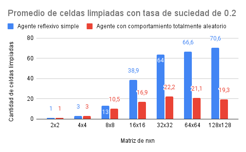

# Reporte ejercicios 3 y 4
## Introducción
Se realizaron experimentos para simular y comparar la medida de rendimiento, de dos agentes diferentes (agente reflexivo simple y agente con comportamiento totalmente aleatorio), para el conocido entorno del mundo de la aspiradora. 
## Marco Teórico
**Entorno**
El entorno es una grilla de nxn casilleros, parcialmente observable, donde cada casillero puede estar sucio (1) o limpio (0). 
**Agentes**
Los agentes, construidos utilizando PEAS, tendrán una medida de performance. 
Esta medida será tomada según cuantos casilleros fueron limpiados por los agentes. 
Las acciones permitidas a los agentes son: 
- Arriba
- Abajo
- Izquierda
- Derecha
- Limpiar (aspirar)
- NoHacerNada

La diferencia de los agentes es que el agente reflexivo evalúa el casillero en el que se encuentra, para decidir limpiar o no hacer nada, ahorrando pasos cuando escoge no hacer nada. Mientras que, el agente con comportamiento totalmente aleatorio, no observa el entorno en ningún momento, y como lo indica su nombre, su comportamiento es aleatorio. 
## Diseño experimental
El experimento consta de evaluar y comparar el desempeño de los agentes diseñados anteriormente, con combinaciones de parametros de porcentaje de suciedad y cantidad de celdas nxn del entorno, para los dos agentes. 
El desempeño consta de cuantas celdas fueron limpiadas por los agentes, en un maximo de mil movimientos.
Cada entorno, junto con la posicion inicial del agente, se genera con una semilla, obteniendo asi, el mismo entorno a probar con los dos agentes y posibilitando la replicacion del experimento.
Para cada combinacion de porcentaje de suciedad y cantidad de celdas nxn, se generan 10 entornos diferentes y se evalua el desempeño de ambos agentes.

**Parametros utilizados**
- Entornos de: 2 × 2, 4 × 4, 8 × 8, 16 × 16, 32 × 32, 64 × 64, 128 × 128.
- Porcentaje de suciedad en el ambiente: 0.1, 0.2, 0.4, 0.8

## Análisis de resultados
Para visualizar y analizar los resultados obtenidos, estos fueron graficados según el promedio de celdas limpiadas con tasa de suciedad de 0.1, obtenido a partir de la división de la suma de todos los desempeños obtenidos en los 10 entornos, entre la cantidad de entornos (10). 

Se puede observar cómo en entornos con pequeña dimensión, los dos agentes no difieren en el promedio de celdas limpiadas, en cambio, cuando las dimensiones aumentan, la diferencia entre los dos agentes es notables, se puede visualizar una amplia ventaja del agente reflexivo simple en comparación al agente con comportamiento completamente aleatorio. 

Luego fueron graficados respecto a la Tasa de acierto de barrido con tasa de suciedad de 0.1, esta se obtiene a partir de la división la suma de todos los desempeños (celdas limpiadas) obtenidos en los 10 entornos, entre la cantidad de celdas por limpiar. 

Se puede observar lo mismo que en la anterior medición, y además, se encuentra que la máxima diferencia en la tasa de acierto de barrido entre los dos agentes es cuando el entorno es de dimensión 16 x 16. Que en 8 x 8 y 32 x 32, las diferencias entre los agentes de la tasa de acierto de barrido es prácticamente la misma. 

Por último, que a partir de 32 x 32 la diferencia en la tasa de acierto comienza a disminuir, pero que el agente reflexivo simple siempre mantiene una ventaja respecto al otro agente. 

Todos los datos y gráficos pueden ser observados en la siguiente [Planilla de excel](https://docs.google.com/spreadsheets/d/1C_xq2UpsbgFqWO-xnWEKY8y1pKPV_egLdK46CjPw7GI/edit?usp=sharing)

## Conclusión
Con base en los resultados, se concluye que el agente reflexivo simple, a partir de entorno mayores a 4 x 4 mantiene una ventaja sobre el agente aleatorio. Por ende, se recomienda elegir, entre estos dos agentes, al agente reflexivo simple. 