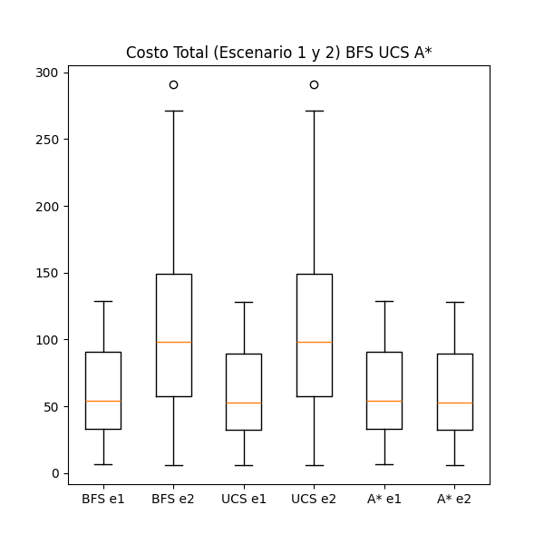

# Reporte Búsquedas no Informadas e Informadas

## Introducción
Se realizaron experimentos en 30 entornos deterministas, aleatorios, de 100 x 100, en los que algunas celdas representan un obstáculo para el agente (agujeros en el hielo). El objetivo es probar distintos agentes de búsquedas no informadas e informadas para que, dado un punto de inicio y un punto destino en cada entorno, encuentren el camino óptimo.

## Marco Teórico

**Entorno**

Entorno determinista, aleatorio, de 100 × 100, cuyas celdas representan un obstáculo para el agente (agujeros en el hielo) con una probabilidad de 0,08.

- Escenario 1: Cada acción tiene un costo de 1.
- Escenario 2: Las acciones tienen un costo asociado que varía de acuerdo con la acción; es decir, moverse a la izquierda tiene un costo de 1, moverse hacia abajo tiene un costo de 2, etc.

**Agentes**

El agente debe ser capaz de resolver el problema planteado mediante los siguientes algoritmos de búsqueda no informada:
1. Búsqueda por Anchura.
2. Búsqueda por Profundidad.
3. Búsqueda por Profundidad Limitada (límite = 10).
4. Búsqueda de Costo Uniforme.
5. Búsqueda A*.
6. Aleatorio.

## Diseño Experimental
El experimento consiste en evaluar y comparar el desempeño de los agentes mencionados anteriormente en los entornos descritos. Los aspectos evaluados son: el costo de llegar al punto de destino, el tiempo empleado y las celdas exploradas. 

Si el costo y las celdas exploradas son igual a 0, significa que no se encontró un camino o que se alcanzó un límite de 1000 movimientos. Cada entorno, junto con la posición inicial del agente, se genera con una semilla para asegurar la replicación del experimento.

## Análisis de Resultados
Para visualizar y analizar los resultados obtenidos, se calculó la media y la desviación estándar y luego se representaron en un gráfico de cajas y bigotes según el costo total en los escenarios 1 y 2:

  

Se observa que tanto el DLS como el agente aleatorio no encuentran caminos hacia la meta en ninguna de las 30 simulaciones. Asimismo, el DFS muestra un rendimiento bastante inferior en comparación con los demás algoritmos de búsqueda que sí hallaron un camino óptimo.

Una observación interesante surge al analizar el gráfico de cajas y extensiones del costo total sin los tres algoritmos mencionados anteriormente:

En este gráfico, se aprecia la superioridad del A* en comparación con BFS y UCS, ya que cuando se asocia un costo variable al movimiento del agente, A* prácticamente mantiene su costo. En contraste, BFS y UCS incrementan su costo de una media de 50 a una media de 100.

También se observa que la cantidad de estados explorados entre BFS, UCS y A* es prácticamente la misma.

Por último, se representa el tiempo empleado en el escenario 2 mediante un gráfico de cajas y extensiones:

Se puede observar que A*, al ser de búsqueda informada, es el más rápido en contraste con BFS, DFS y UCS.

## Conclusión
Con base en los resultados, se concluye que el mejor algoritmo de los seis comparados para que, dado un punto de inicio y un punto destino en los entornos, encuentren el camino óptimo, es A*, dado que mantiene el costo cuando la función de costo asociada deja de ser constante y por ser el más veloz.
