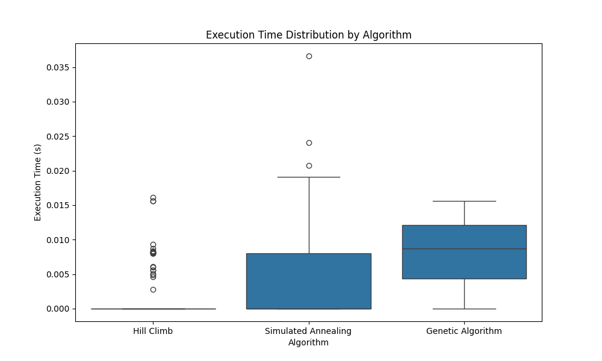

# Reporte Búsquedas no Informadas e Informadas 

 

## Introducción 

El problema de las N reinas consiste en colocar N reinas en un tablero de ajedrez de N x N de tal manera que ninguna reina ataque a otra. Esto implica que no pueden compartir la misma fila, columna o diagonal. Pese a su sencillez, el problema presenta un desafío significativo en cuanto a búsqueda y optimización, especialmente a medida que aumenta el número de reinas. 

 

El objetivo de este informe es evaluar la eficacia de diferentes algoritmos de búsqueda local. En particular, se ejecutarán 30 pruebas para cada uno de los algoritmos desarrollados, utilizando tableros de tamaños 4, 8 y 10 reinas. 

 

La evaluación se centrará en la comparación de los resultados obtenidos en términos de tiempo de ejecución y calidad de las soluciones, permitiendo así una comprensión más profunda de las ventajas y desventajas de cada algoritmo en el contexto del problema de las N reinas. 

 

## Marco Teórico 

 

**Entorno** 

 

Tres entornos deterministas, aleatorios, de nxn, siendo n = 4, 8 y 10. La misma cantidad representa la cantidad de reinas en el tablero. 

El tablero se representa como un vector donde cada índice del vector representa la fila del tablero y el valor representa columna donde se encuentra la reina en esa fila. 

 

**Agentes** 

 

El agente debe ser capaz de resolver el problema planteado mediante los siguientes algoritmos de búsqueda local: 

1. Hill Climb. 

2. Simulate Annealing. 

3. Algoritmo genético: 

a) Definición de los individuos de la población: Vectores que representas soluciones posibles del problema. 

b) Estrategia de selección: Se utilizó un enfoque de selección de elite, donde selecciona al 20% de la población con mejor heurística. Luego se seleccionan individuos del resto de la población para generar nuevos hijos. 

Se eligió esta estrategia ya que acelera el tiempo de convergencia al mantener las mejores soluciones (se busca que la heurística sea si o si igual a 0), además de reducir la variabilidad.  

c) Estrategia de reemplazo: Combinar los individuos de élite con los nuevos individuos generados a partir del cruce y la mutación. En cada iteración del algoritmo, se reemplaza la población anterior con los 6 mejores individuos de la élite y los nuevos hijos generados, manteniendo así una diversidad genética en la población. 

 

## Diseño Experimental 

 

El experimento consiste en evaluar y comparar el desempeño de los agentes mencionados anteriormente en los entornos descritos. Los aspectos evaluados son: Tiempo de ejecución, el porcentaje de veces que se llega a un estado de solución óptimo, cantidad de iteraciones necesarias para encontrar el mejor escenario, con un límite de 1000 iteraciones. 

 

## Análisis de Resultados 

 

Para visualizar y analizar los resultados obtenidos, se calculó la media y la desviación estándar y luego se representaron en un gráfico de cajas y bigotes según el tiempo de ejecución: 

 

   

 

Como es de esperar, debido a la complejidad de los algoritmos, "hill climb" es el de mejor tiempo de ejecución, luego "simulate annealing" y por último el algoritmo genético con enfoque de elite. 

 

Una observación interesante surge al analizar el gráfico de barras del porcentaje de veces que se llega a un estado de solución óptimo: 

 

 

 

En la cual se puede observar la superioridad y efectividad para alcanzar la solución óptima del algoritmo genético con enfoque de elite con respecto a los otros dos algoritmos desarrollados, también se puede visualizar que tanto "hill climb" como "simulate annealing" disminuyen el porcentaje de acierto con el aumento de reinas, aunque se denota eficiencia de "simulate annealing" respecto a "hill climb". 

 

Luego se realizó un gráfico de caja y extensiones que representa las iteraciones realizadas en todos los escenarios para llegar al corte. 

 

 

 

Se encuentra que el algoritmo que menor iteraciones realiza es el Hill climb, pero como se analizó anteriormente, este suele no llegar a la solución óptima. En cambio, el algoritmo genético, no solo realiza pocas iteraciones, sino que siempre obtiene la solución optima. Dejando en evidencia la superioridad contra "simulated annealing" el cual ha llegado a las 1000 iteraciones y al menos el 50% de sus iteraciones están entre las 200 y 750. 

 

Por último se graficó la variación de la función H() a lo largo de las iteraciones de "hill climb" y de "Simulate annealing", siendo el escenario de 8 reinas y semilla 5. 

 

 

 

 

 

Donde se puede observar como mediante la ejecución simulated annealing varia la heurística, tanto aumentando como disminuyéndola, hasta alcanzar el óptimo en aproximadamente la iteración 260. 

 

## Conclusión 

Concluye que el mejor algoritmo de los tres comparados es el algoritmo genético con enfoque elitista. Dado a que, aunque el tiempo de ejecución sea más elevado, siempre alcanza el óptimo en pocas iteraciones. 

 

 