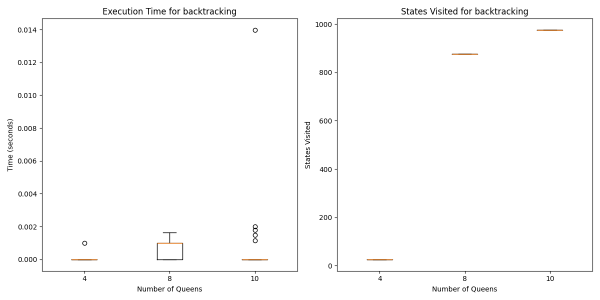
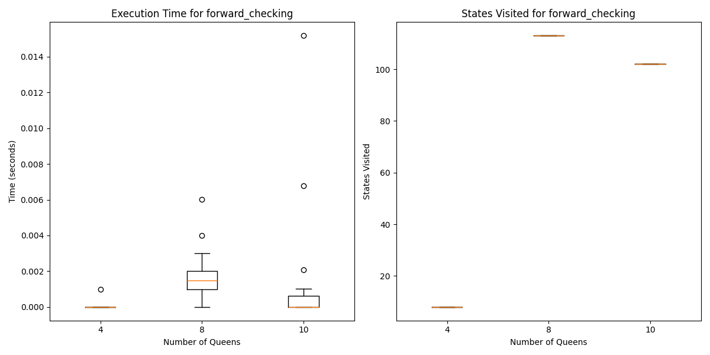

# TP 6: SATISFACCIÓN DE RESTRICCIONES

1. Describir en detalle una formulación CSP para el Sudoku.
Valores: Xi,j. Con 0 <= i <= 9 y 0 <= j <= 9, esto forma 81 variables.

Dominio: {1,2,3,4,5,6,7,8}

Restricciones:

No debe repetirse el numero en la misma fila
No debe repetirse el numero dentro del cuadrado 3x3 (Region):
|------------------|------------------|------------------| |i=0 - j=0,..., j=9|i=1 - j=0,..., j=9|i=2 - j=0,..., j=9| |i=3 - j=0,..., j=9|i=4 - j=0,..., j=9|i=5 - j=0,..., j=9| |i=6 - j=0,..., j=9|i=7 - j=0,..., j=9|i=8 - j=0,..., j=9|

No debe repetirse el numero en la misma columna
2. Utilizar el algoritmo AC-3 para demostrar que la arco consistencia puede detectar la inconsisten cia de la asignación parcial WA=red, V=blue para el problema de colorear el mapa de Australia(Figura 6.1 AIMA 3ra edición )
Mapa

a. RemoveSA−WA,deleteGfrom SA. b. RemoveSA−V,deleteR from SA,leavingonlyB. c. RemoveNT−WA,deleteG from NT. d. RemoveNT−SA,deleteB from NT,leavingonlyR. e. RemoveNSW−SA,deleteB from NSW. f. RemoveNSW−V,deleteR from NSW,leavingonlyG. g. RemoveQ−NT,deleteR from Q. h. RemoveQ−SA,deleteB from Q. i. removeQ−NSW,deleteG from Q,leavingnodomainforQ.

3. ¿Cual es la complejidad en el peor caso cuando se ejecuta AC-3 en un arbol estructurado CSP? (i.e. cuando el grafo de restricciones forma un arbol: cualquiera dos variables estan relacionadas por a lo sumo un camino)
Un CSP con estructura de árbol (tree-structured CSP) es un problema de satisfacción de restricciones (CSP) cuyo grafo de restricciones tiene una estructura de árbol. Esto significa que las variables en el CSP están organizadas de tal manera que no hay ciclos en el grafo de restricciones. En términos más formales:

Las variables son los nodos del grafo. Las restricciones entre variables son los arcos (edges) que conectan estos nodos.

AC-3 Pseudo codigo

En un arbol estructurado CSP, ningun arco va a ser tomado mas de una vez, por lo tanto AC-3 va a ser O(ED), siendo E el numero de arcos y D el tamaño del Dominio.

4. AC-3 coloca de nuevo en la cola todo arco (Xk,Xi) cuando cualquier valor es removido del dominio de Xi incluso si cada valor de Xk es consistente con los valores restantes de Xi. Supongamos que por cada arco (Xk,Xi) se puede llevar la cuenta del numero de valores restantes de Xi que sean consistentes con cada valor de Xk. Explicar como actualizar ese numero de manera eficiente y demostrar que la arco consistencia puede lograrse en un tiempo total O(n^2 * d^2).
Para hacer de manera mas eficiente, la idea es preprocesar las restricciones. Por ende para cada valor de xi, guardamos las variables xk para las cuales, un arco desde xk a xi es satisfacible por un valor particular de xi. Luego cuando el valor de xi es borrado, se reduce por 1 el contador de valores posibles para cada arco (xk, xi) que fueron guardados para ese valor en particular.

Iteraciones por Arcos: En el peor de los casos, el algoritmo puede necesitar revisar cada arco O(n^2) veces, donde n es el número de variables. Esto se debe a que, en un CSP completo, cada variable puede estar conectada a cada otra variable.
Operaciones en el Dominio: Para cada arco, el algoritmo debe comprobar todos los valores en el dominio, que puede tener un tamaño máximo de d. En el peor de los casos, esto se hace para cada arco y cada valor, lo que da como resultado un tiempo O(d^2)

5. Demostrar la correctitud del algoritmo CSP para arboles estructurados (seccion 6.5, AIMA 3ra edicion). Para ello, demostrar:
a) Para un CSP cuyo grafo de restricciones es un arbol, la 2-consistencia (consistencia de arco) implica n−consistencia, siendo n el numero total de variables.

2-Consistencia: Directed arc consistency or DAC. A CSP is defined to be directed arc-consistent under an ordering of variables X1,X2,...,Xn if and only if every Xi is arc-consistent with each Xj for j>i.

n-consistencia: Un CSP es n-consistente si, para cualquier subconjunto de n−1 variables, cualquier valor asignado a estas n−1 variables puede ser extendido a una n-ésima variable, respetando todas las restricciones del problema. Esto implica que no solo las restricciones binarias (entre dos variables) se cumplen, sino que también cualquier conjunto de valores es extendible de manera consistente a todas las variables.

En un árbol, la 2-consistencia asegura que para cada par de variables conectadas, los valores respetan las restricciones entre ellas. Gracias a la falta de ciclos en los árboles, la consistencia local entre pares de variables se propaga globalmente sin generar conflictos. Como resultado, cualquier subconjunto de n−1 variables que sea consistente puede ser extendido a la n-ésima variable sin romper las restricciones, lo que implica n-consistencia.

b) Argumentar por que lo demostrado en 5a es suficiente.

La demostración en 5a es suficiente porque, en un CSP cuyo grafo de restricciones es un árbol, alcanzar la 2-consistencia asegura que el problema es completamente resoluble sin necesidad de aplicar métodos adicionales para asegurar la n-consistencia. Esta propiedad hace que los CSPs en árboles sean altamente eficientes de resolver, ya que verificar y propagar restricciones locales garantiza una solución globalmente consistente.

# Informe Backtracking y Forward Checking

## Introducción
El problema de las N reinas consiste en colocar N reinas en un tablero de ajedrez de N x N de tal manera que ninguna reina ataque a otra. Esto implica que no pueden compartir la misma fila, columna o diagonal. Pese a su sencillez, el problema presenta un desafío significativo en cuanto a búsqueda y optimización, especialmente a medida que aumenta el número de reinas.

El objetivo de este informe es evaluar la eficacia de diferentes algoritmos de satisfacción de restricciones. En particular, se ejecutarán 30 pruebas para cada uno de los algoritmos desarrollados, utilizando tableros de tamaños 4, 8 y 10 reinas.

La evaluación se centrará en la comparación de los resultados obtenidos en términos de tiempo de ejecución y cantidad de estados visitados, dado a que ambos algoritmos siempre encuentran la solución, permitiendo así una comprensión más profunda de las ventajas y desventajas de cada algoritmo en el contexto del problema de las N reinas.

## Marco Teórico

### Entorno

Tres entornos deterministas, aleatorios, de nxn, siendo n = 4, 8 y 10. La misma cantidad representa la cantidad de reinas en el tablero.

El tablero se representa como un vector donde cada índice del vector representa la fila del tablero y el valor representa columna donde se encuentra la reina en esa fila.

### Agentes

El agente debe ser capaz de resolver el problema planteado mediante los siguientes algoritmos de búsqueda local:

- BackTracking.
- Forward Checking.

## Diseño Experimental

El experimento consiste en evaluar y comparar el desempeño de los agentes mencionados anteriormente en los entornos descritos. Los aspectos evaluados son: Tiempo de ejecución y cantidad de estados visitados.

## Análisis de Resultados

Para visualizar y analizar los resultados obtenidos, se calculó la media y la desviación estándar y luego se representaron en un gráfico de cajas y bigotes según el tiempo de ejecución y según la cantidad de estados visitados:

Se puede observar que el Backtracking es mas veloz que el Forward Checking, pero que no en exceso.
En cuanto a la cantidad de estados visitados denota la superioridad del Forward Checking con respecto al Bactracking, siendo hasta 90% mas eficiente en términos de estados visitados

## Conclusión

Se concluye que el Forward Checking es una mejor solución que Backtracking, dado a que aunque sea un poco mas lento, visita hasta 90% menos estados.