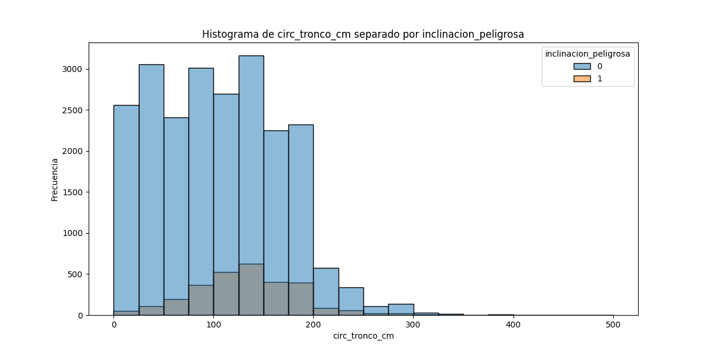

# PARTE A

### Análisis del archivo `arbolado-mendoza-dataset-train.csv`

#### 1. ¿Cuál es la distribución de la clase `inclinacion_peligrosa`?

La distribución de la clase `inclinacion_peligrosa` es la siguiente:

- **0** (sin inclinación peligrosa): 88.77%
- **1** (inclinación peligrosa): 11.23%

Esta distribución muestra que la mayoría de los árboles no presentan inclinación peligrosa en este conjunto de datos.

#### 2. ¿Se puede considerar alguna sección más peligrosa que otra?

A continuación, se muestra el porcentaje de inclinaciones peligrosas por sección:

| Sección | Inclinación No Peligrosa (0) | Inclinación Peligrosa (1) |
| ------- | ----------------------------- | -------------------------- |
| 1       | 88.97%                        | 11.03%                     |
| 2       | 85.04%                        | 14.96%                     |
| 3       | 85.40%                        | 14.60%                     |
| 4       | 86.94%                        | 13.06%                     |
| 5       | 87.18%                        | 12.82%                     |
| 6       | 94.24%                        | 5.76%                      |
| 7       | 90.34%                        | 9.66%                      |
| 8       | 97.50%                        | 2.50%                      |
| 11      | 100.00%                       | 0.00%                      |

**Conclusión**: La sección 2 presenta el mayor porcentaje de inclinaciones peligrosas (14.96%) y podría considerarse la más peligrosa en este conjunto de datos.

#### 3. ¿Se puede considerar alguna especie más peligrosa que otra?

El siguiente cuadro presenta el porcentaje de inclinaciones peligrosas por especie:

| Especie             | Inclinación No Peligrosa (0) | Inclinación Peligrosa (1) |
| ------------------- | ----------------------------- | -------------------------- |
| Acacia SP           | 84.18%                        | 15.82%                     |
| Acacia visco        | 96.92%                        | 3.08%                      |
| Acer                | 97.87%                        | 2.13%                      |
| Aguaribay           | 90.75%                        | 9.25%                      |
| Ailanthus           | 96.30%                        | 3.70%                      |
| Algarrobo           | 60.00%                        | 40.00%                     |
| Arabia              | 100.00%                       | 0.00%                      |
| Braquiquito         | 100.00%                       | 0.00%                      |                       
| Morera              | 81.45%                        | 18.55%                     |
| Tipa                | 89.33%                        | 10.67%                     |
| álamo blanco        | 94.85%                        | 5.15%                      |
| álamo criollo       | 98.36%                        | 1.64%                      |
| árbol del cielo     | 100.00%                       | 0.00%                      |

**Conclusión**: Entre las especies, el **algarrobo** destaca con un 40% de inclinaciones peligrosas, por lo que podría considerarse una de las especies más riesgosas en cuanto a inclinación peligrosa en este conjunto de datos.
### A partir del archivo arbolado-mendoza-dataset-train.csv
#### Generar un histograma de frecuencia para la variable circ_tronco_cm. Probar con diferentes  números de bins.  

#### Repetir el punto b) pero separando por la clase de la variable inclinación_peligrosa?

