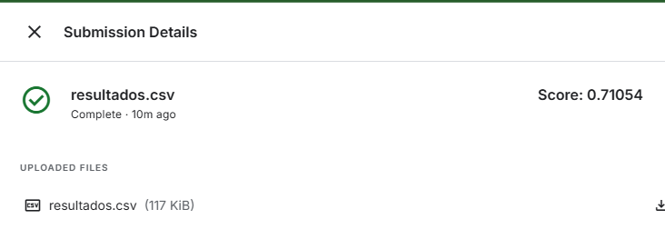

## Descripción del proceso de preprocesamiento
Antes de entrenar el modelo de Random Forest, se realizaron varias etapas de preprocesamiento en los datos para garantizar que el modelo recibiera información relevante y balanceada. A continuación se detallan los pasos seguidos:

#### 1. Filtrado de Datos
Selección de árboles con inclinación peligrosa: Se filtraron todos los árboles que tenían la propiedad inclinacion_peligrosa igual a 1. Este conjunto de datos es crucial ya que representa el caso de interés en este problema.
Selección de árboles con inclinación no peligrosa: Para balancear las clases, se seleccionaron árboles con inclinacion_peligrosa igual a 0. Se utilizó la función sample_n() para seleccionar un número igual de árboles con inclinación no peligrosa que de árboles con inclinación peligrosa (3500 árboles de cada clase).
#### 2. Unión de los Conjuntos de Datos
Se combinaron las muestras filtradas de árboles con inclinación peligrosa y no peligrosa utilizando la función rbind(), creando un conjunto de datos balanceado para el entrenamiento del modelo.
#### 3. Selección de Variables
Eliminación de variables irrelevantes: Se eliminaron las siguientes columnas del conjunto de datos para evitar incluir variables que no aportan información relevante para la predicción:
inclinacion_peligrosa: Es la variable objetivo y no debe ser usada como predictor.
id: Identificador único de cada árbol, no es relevante para el modelo.
nombre_seccion, area_seccion, seccion, ultima_modificacion, circ_tronco_cm: Columnas que no se consideran necesarias para la predicción.
Variables restantes: Las columnas restantes fueron utilizadas como predictores para entrenar el modelo.

#### 4. Entrenamiento del Modelo
Se entrenó un modelo de Random Forest utilizando los predictores seleccionados y la variable de respuesta. El modelo fue configurado con los siguientes parámetros:
Número de árboles: 3900.
Número de variables a probar en cada división (mtry): 3, que es un valor comúnmente utilizado para datasets de clasificación con un número moderado de variables.

## Resultados obtenidos sobre el conjunto de validación
#### Estimación de la tasa de error fuera de la bolsa (OOB)
- **Tasa de error OOB**: 30.27%

### Matriz de Confusión

La matriz de confusión muestra la distribución de las predicciones comparadas con las clases reales:

| Clase real / Predicción | 0     | 1     | Error de clase |
|-------------------------|-------|-------|----------------|
| 0                       | 2265  | 1235  | 0.3529         |
| 1                       | 908   | 2671  | 0.2537         |

## Resultados obtenidos en Kaggle

## Descripción del Algoritmo

El **Random Forest** es un algoritmo de aprendizaje automático basado en un conjunto de árboles de decisión, utilizados para mejorar la precisión y estabilidad del modelo. Es un enfoque de **ensemble learning**, que combina varios modelos para una predicción más robusta.

### 1. Proceso de Entrenamiento

* Subconjuntos Aleatorios (Bootstrap Sampling)
Se crean subconjuntos de datos aleatorios (con reemplazo) para entrenar cada árbol de decisión de forma independiente.

* Árboles de Decisión
Cada árbol se entrena utilizando una selección aleatoria de características en cada nodo, lo que introduce diversidad en el modelo.

* Predicción
Para la predicción, cada árbol vota por la clase que considera más probable. La clase final se determina por mayoría de votos.

### 2. Parámetros del Modelo

- **ntree**: Número de árboles en el modelo (3900 en este caso).
- **mtry**: Número de variables a probar en cada división (3 en este caso).

### 3. Evaluación del Modelo

- **OOB Error**: Estimación del error de clasificación usando las observaciones no seleccionadas para cada árbol.
- **Matriz de Confusión**: Muestra el desempeño del modelo, permitiendo calcular métricas como la precisión y el recall.

